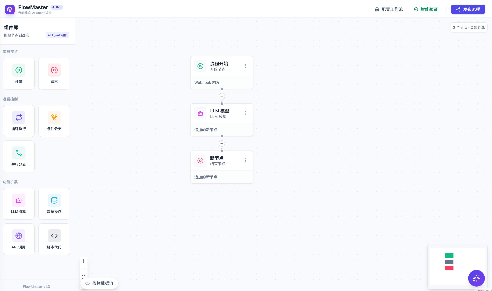
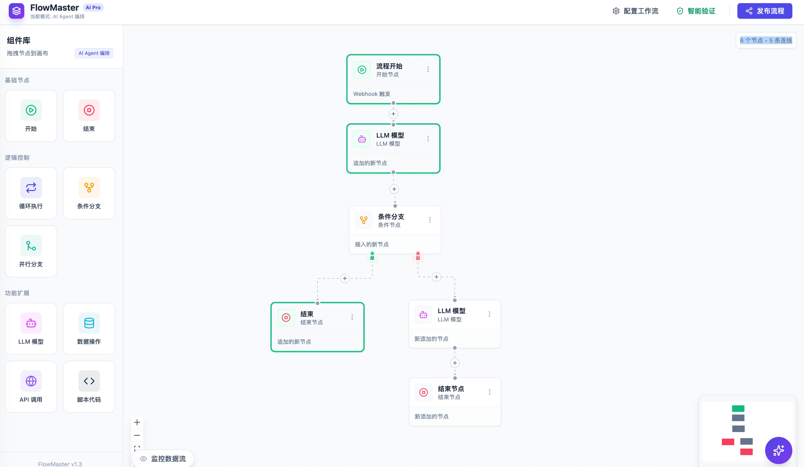
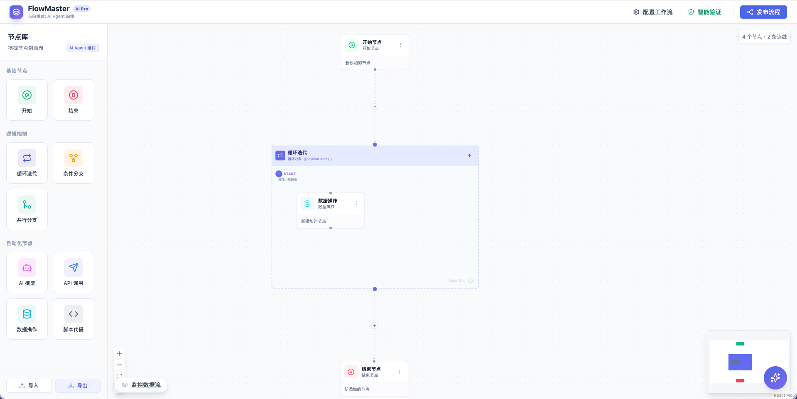
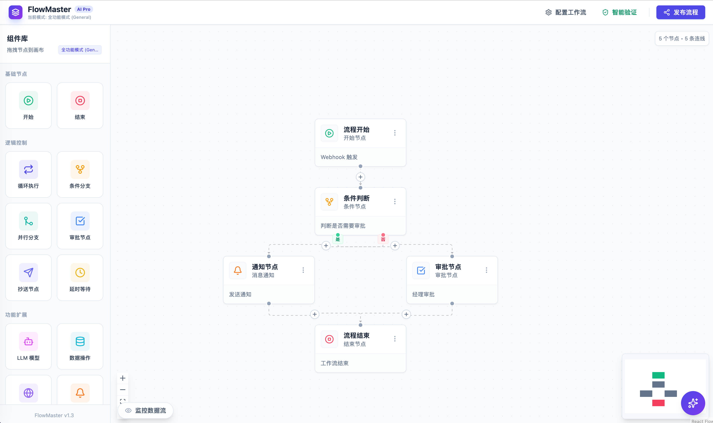
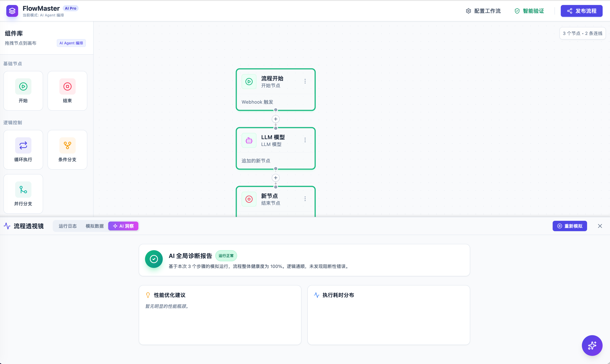
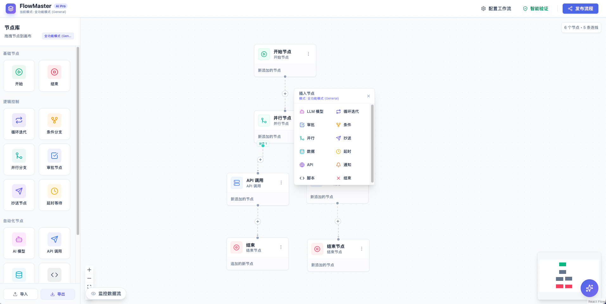
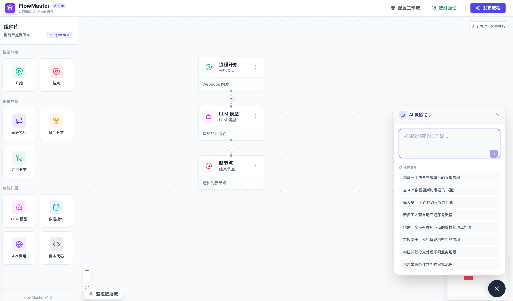
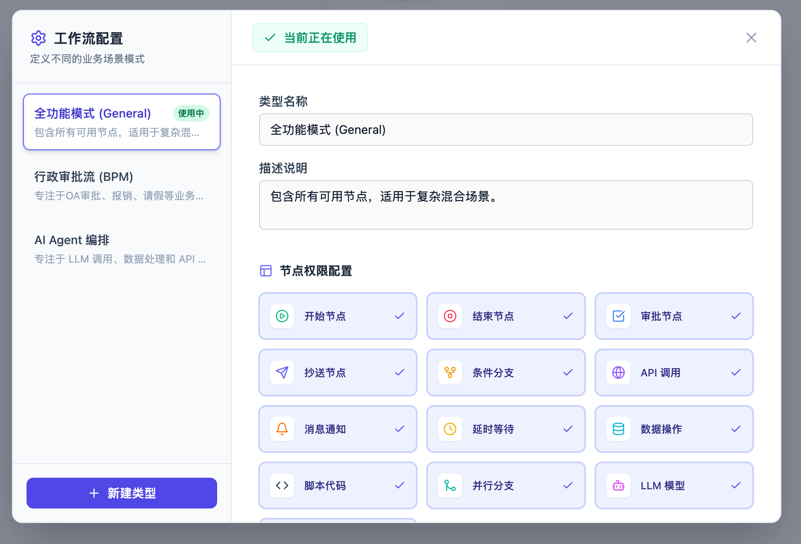

<div align="center">

</div>

🌐 官网: [www.bintelai.com](https://www.bintelai.com)

## 📸 功能截图










# AI 工作流编辑器

一个基于 ReactFlow 的可视化工作流编辑器，提供直观、灵活的平台，用于设计和管理各种复杂的工作流，特别是结合 AI 能力的工作流。

## ✨ 功能特性

- 🎨 **可视化工作流编辑**: 基于拖拽的直观工作流设计界面
- 🧩 **丰富的节点类型**: 支持 15+ 种节点类型，涵盖业务流程、AI 能力、数据操作等
- 🔗 **变量绑定与复用**: 统一的变量系统，支持全局变量、节点输出、系统变量等
- 🤖 **AI 辅助生成**: 集成 AI 能力，支持自然语言生成工作流
- 🧪 **工作流仿真**: 内置仿真运行器，支持工作流调试和预览
- 📂 **分类管理**: 支持节点分类，便于快速查找和使用
- 🎯 **配置面板**: 每个节点都有专门的配置面板，支持变量绑定和智能补全

## 🛠️ 技术栈

| 技术 | 版本 | 说明 |
|------|------|------|
| React | ^19.2.1 | UI 框架 |
| TypeScript | ~5.8.2 | 类型安全 |
| ReactFlow | 11.11.4 | 流程图引擎 |
| Zustand | 4.5.2 | 状态管理 |
| Tailwind CSS | ^4.1.18 | 样式框架 |
| Vite | ^6.2.0 | 构建工具 |
| Lucide-React | 0.561.0 | 图标库 |

## 📦 项目结构

```
ai-工作流/
├── components/
│   └── Workflow/              # 核心工作流组件
│       ├── configs/           # 节点配置面板
│       │   ├── common.tsx     # 通用组件
│       │   ├── VariableBindModal.tsx  # 变量绑定弹窗
│       │   └── [NodeName]Config.tsx   # 各节点配置
│       ├── edges/             # 自定义边组件
│       │   └── CustomEdge.tsx
│       ├── nodes/             # 节点组件
│       │   ├── BaseNode.tsx   # 基础节点
│       │   └── [NodeName]Node.tsx  # 各节点实现
│       ├── store/             # 状态管理
│       │   ├── useWorkflowStore.ts  # 主 Store
│       │   ├── simulationRunner.ts   # 仿真运行器
│       │   └── modules/       # Store 模块
│       ├── validators/        # 验证器
│       ├── WorkflowApp.tsx    # 主应用组件
│       ├── WorkflowCanvas.tsx # 工作流画布
│       ├── ConfigPanel.tsx    # 配置面板
│       └── Sidebar.tsx        # 侧边栏
├── .trae/                     # 项目配置
│   ├── documents/             # 项目文档
│   └── rules/                 # 开发规则
├── backupDel/                 # 已删除文件备份
├── 项目计划/                  # 项目规划文档
├── App.tsx                    # 应用入口
├── index.tsx                  # 渲染入口
├── package.json               # 项目配置
└── vite.config.ts             # Vite 配置
```

## 🚀 快速开始

### 前置要求

- Node.js (推荐 v18+)
- pnpm (推荐最新版本)

### 安装依赖

```bash
pnpm install
```

### 配置环境变量

创建 `.env.local` 文件并设置以下变量：

```env
OPENAI_API_KEY=your_openai_api_key_here
OPENAI_BASE_URL=https://api.openai.com/v1
OPENAI_MODEL=gpt-4o-mini
```

### 启动开发服务器

```bash
pnpm run dev
```

访问 http://localhost:5173 查看应用

### 构建生产版本

```bash
pnpm run build
```

### 预览生产版本

```bash
pnpm run preview
```

## 🧩 节点类型

| 节点类型 | 中文名称 | 功能描述 |
|---------|---------|---------|
| START | 开始节点 | 工作流入口，定义全局参数 |
| END | 结束节点 | 工作流出口，定义输出 |
| CONDITION | 条件节点 | 根据条件判断流向 |
| PARALLEL | 并行节点 | 并行执行多个分支 |
| LOOP | 循环节点 | 遍历数组执行循环逻辑 |
| API_CALL | API 调用 | 调用外部 API 服务 |
| SQL | SQL 节点 | 执行数据库查询 |
| APPROVAL | 审批节点 | 人工审批流程 |
| CC | 抄送节点 | 通知相关人员 |
| NOTIFICATION | 通知节点 | 发送各种通知 |
| DELAY | 延时节点 | 等待指定时间 |
| DATA_OP | 数据操作 | 数据转换和处理 |
| SCRIPT | 脚本节点 | 运行自定义脚本 |
| LLM | LLM 模型 | 调用大语言模型 |
| KNOWLEDGE_RETRIEVAL | 知识库检索 | 从知识库中检索信息 |
| DOCUMENT_EXTRACTOR | 文档提取器 | 从文档中提取内容 |

## 🔧 变量系统

### 变量引用格式

- **全局变量**: `{{payload.key}}`
- **上游节点输出**: `{{nodes.[nodeId].output_field}}`
- **系统变量**: `{{system.timestamp}}`
- **循环上下文**: `{{loop.item}}` 或 `{{loop.index}}`

### 变量组件

项目提供了统一的变量处理组件：

- **VariableSelector**: 单变量选择器，适用于下拉框场景
- **VariableInput**: 混合文本与变量输入，适用于 URL、提示词等
- **VariableTextArea**: 多行文本与变量输入，适用于 SQL、脚本等
- **VariableBindModal**: 变量绑定弹窗，支持搜索和过滤

## 📖 开发指南

### 新增节点

1. 在 `types.ts` 中添加节点类型枚举
2. 在 `BaseNode.tsx` 中配置图标、标签和颜色
3. 创建节点组件 `components/Workflow/nodes/[NodeName]Node.tsx`
4. 创建配置组件 `components/Workflow/configs/[NodeName]Config.tsx`
5. 在 `ConfigPanel.tsx` 中添加渲染逻辑
6. 在 `simulationRunner.ts` 中实现执行逻辑

详细开发规范请参考 `.trae/rules/project_rules.md`

### 代码规范

- 单文件代码量控制在 700 行以内
- 遵循 DRY 原则，复用通用组件
- 使用设计模式（策略模式、工厂模式等）
- 使用 pnpm 作为包管理器
- 删除文件需移动到 `backupDel` 目录

### 状态管理

使用 Zustand 进行状态管理，Store 模块化组织：

- `nodeActions.ts`: 节点操作
- `edgeActions.ts`: 边操作
- `simulationActions.ts`: 仿真操作
- `categoryActions.ts`: 分类操作
- `nodeOutputActions.ts`: 节点输出操作
- `aiActions.ts`: AI 功能操作

## 🧪 工作流仿真

项目内置仿真运行器，支持：

- 工作流验证
- 节点执行状态跟踪
- 变量替换和求值
- 执行日志记录
- 节点输出预览

## 🤖 AI 功能

### AI 辅助生成

- 根据自然语言描述生成工作流
- 智能填充节点配置
- 提供配置建议和优化

### AI 命令中心

- 自然语言创建节点
- 自然语言修改配置
- 智能工作流优化

## 📚 文档

- [项目分析文档](./项目分析文档.md)
- [开发规则](./.trae/rules/project_rules.md)
- [变量使用文档](./.trae/rules/变量使用文档.md)
- [项目计划](./项目计划/)

## 🤝 贡献指南

欢迎贡献代码！请遵循以下步骤：

1. Fork 本仓库
2. 创建特性分支 (`git checkout -b feature/AmazingFeature`)
3. 提交更改 (`git commit -m 'Add some AmazingFeature'`)
4. 推送到分支 (`git push origin feature/AmazingFeature`)
5. 开启 Pull Request

## 📄 许可证

本项目采用 MIT 许可证 - 查看 LICENSE 文件了解详情

## 🙏 致谢

- [ReactFlow](https://reactflow.dev/) - 强大的流程图库
- [Zustand](https://zustand-demo.pmnd.rs/) - 轻量级状态管理
- [Tailwind CSS](https://tailwindcss.com/) - 实用优先的 CSS 框架
- [Lucide](https://lucide.dev/) - 美观的图标库

## 📮 联系方式

如有问题或建议，欢迎提交 Issue 或 Pull Request

---

<div align="center">
Made with ❤️ by AI Studio Team
</div>
